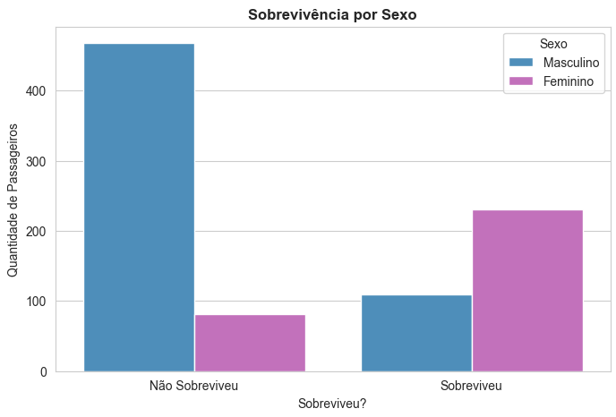
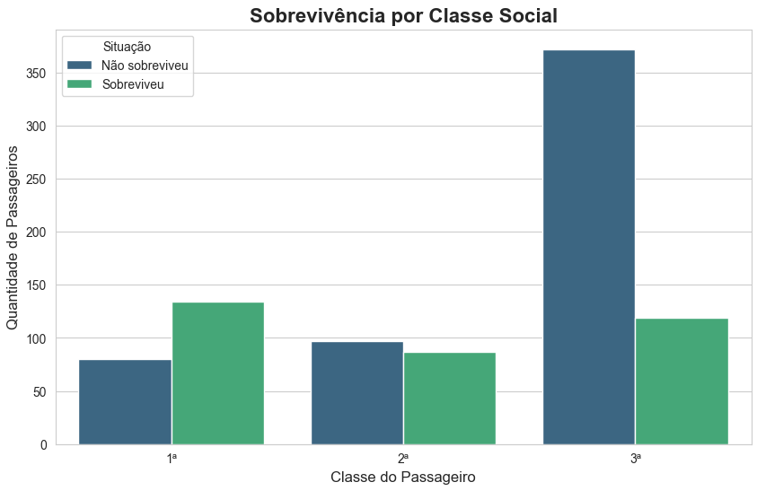
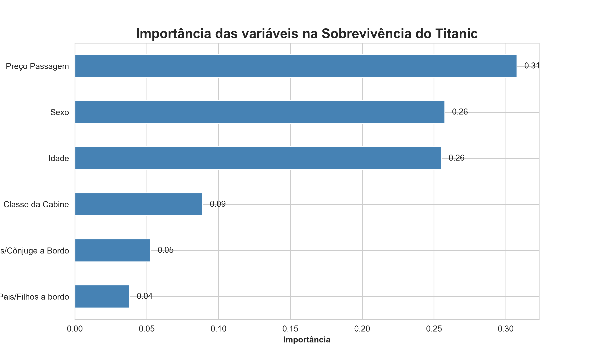

# 🚢 Titanic Survival Prediction with Machine Learning

This project applies **Machine Learning techniques** to predict whether a passenger survived the Titanic disaster based on historical passenger data.

The model analyzes passenger information and predicts the probability of survival using classification algorithms.

This project was developed as part of my studies in **Data Science and Machine Learning using Python**.

---

# Project Overview

The Titanic dataset is one of the most famous datasets used in data science and machine learning.

In this project, a machine learning model was trained to **identify patterns that influenced passenger survival**, such as gender, passenger class, and ticket price.

The workflow includes:

- Data preprocessing  
- Exploratory Data Analysis (EDA)  
- Feature encoding  
- Model training  
- Model evaluation  
- Prediction analysis  

---

# Exploratory Data Analysis

## Survival by Gender

The analysis shows a strong correlation between **gender and survival**, where female passengers had a much higher survival rate.



---

## Survival by Passenger Class

Passengers from **higher social classes had significantly higher survival rates** compared to those in lower classes.



---

# Machine Learning Model

A **Random Forest Classifier** was used to train the prediction model.

The model identifies which variables are most important for predicting survival.

## Feature Importance



According to the model, the most important features were:

- Ticket Fare  
- Gender  
- Age  
- Passenger Class  

These variables played the biggest role in predicting passenger survival.

---

# Technologies Used

- Python  
- Pandas  
- Scikit-Learn  
- Matplotlib  
- Seaborn  
- Jupyter Notebook  

---

## 📁 Project Structure

```
titanic-ml
│
├── data
│   └── train.csv
│
├── images
│   ├── distribuicao.png
│   ├── distribuicao-idade.png
│   ├── importancia.png
│   ├── sobrevivencia-sexo.png
│   ├── sobrevivencia-classe.png
│   ├── sobrevivencia-por-porto.png
│   └── sobrevivencia-pelo-preco.png
│
├── notebook
│   └── titanic_machine_learning.ipynb
│
├── README.md
└── requirements.txt
```

---

# Objective

The goal of this project is to demonstrate practical skills in:

- Data analysis  
- Feature engineering  
- Machine learning classification  
- Data visualization  
- Predictive modeling  

---

# Future Improvements

Possible improvements include:

- Hyperparameter tuning  
- Testing additional machine learning models  
- Cross-validation  
- Model performance metrics (Precision, Recall, F1-score)

---

# 👨‍💻 Author

**Gabriel Godoi**

🇧🇷 Brasileiro | Analista de Dados em formação

Atualmente desenvolvendo projetos práticos com Python, Análise de Dados e Machine Learning para adquirir experiência real na área de dados.

🔗 LinkedIn  
https://www.linkedin.com/in/gabriel-godoi-298005363

🔗 GitHub  
https://github.com/gabrielgodoiii
